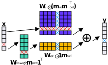
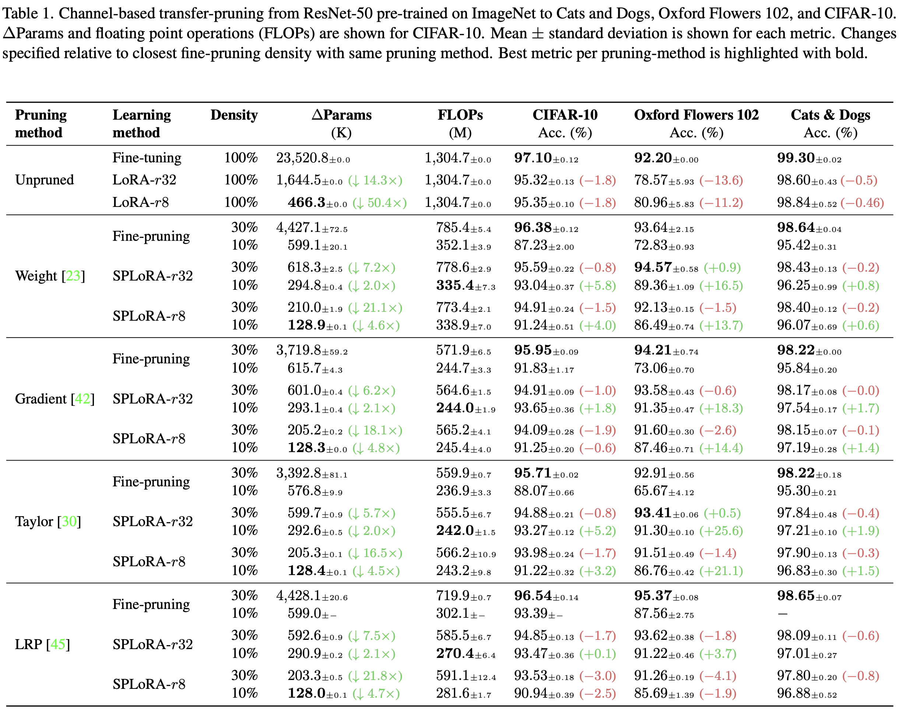
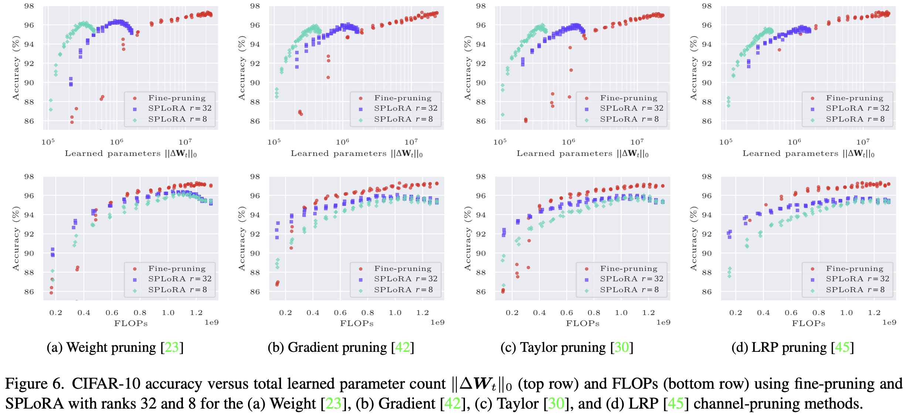

# Channel-based Structured Pruning Adapters Experiments

<div align="left">
  <a href="https://creativecommons.org/licenses/by-nc-sa/4.0/">
    
  </a>
  <a href="https://github.com/psf/black">
    
  </a>
</div>

<div align="center">
  <br>
</div>

This repository contains experiments for the channel-based SPA, __Structured Pruning Low-rank Adapter (SPLoRA)__, proposed in `link-to-paper-comping-up` using various structured pruning methods, for weight-based transfer learning on image classification tasks. 


## Installation ⚙️
- Clone this repository and enter it: 
    ```bash
    git clone https://github.com/LukasHedegaard/channel-spa-experiments.git
    cd channel-spa-experiments
    ```
- (Optionally) create conda environment:
    ```bash
    conda create --name channel-spa-experiments python=3.10
    ```
- Install as editable module
    ```bash
    pip install -e .[dev]
    ```

## Run training + pruning 🏃‍♂️
Please see the `scripts` folder for the scripts used in our experiments. Below, you will find the command-line arguments for selecting splora (argument: `"--splora"`) and each of the explored pruning methods (argument:`"--method-type"`, choices: `["weight", "grad", "taylor", "lrp"]`).

For a complete list of arguments, see:
```bash 
python main.py --help
```

### Structured Pruning Low-rank Adapter (SPLoRA)
```bash
python main.py --prune --splora --splora-rank 8 --splora-init-range 1e-3
```

If `"--splora"` is not specified, fine-tuning will be used.
The commands below are used to specify the pruning methods.

### Layer-wise Relevance Propagation Pruning 
_Yeom et al., "Pruning by explaining: A novel criterion for deep neural network pruning", in: Pattern Recognition 2021_
```bash
python main.py --train --prune --method-type lrp\\
    --arch resnet50 --lr 0.0025 --batch-size 64 --epochs 20 --recovery-epochs 20
```
### Grad Pruning + L2 norm 
_X. Sun et al., "Meprop: sparsified back propagation for accelerated deep learning with reduced overfitting", in: International Conference on Machine Learning (ICML), 2017_
```bash
python main.py --train --prune --method-type grad --norm
```

### Taylor Pruning + L2 Norm 
_P. Molchanov et al., "Pruning convolutional neural networks for resource efficient transfer learning", in: International Conference on Learning Representations (ICLR), 2017_
```bash
python main.py --train --prune --method-type taylor --norm
```

### Weight Pruning + L2 norm
```bash
python main.py --train --prune --method-type weight --norm
```

### Training options
```bash
python main.py --help
```


## Lint project
Lint using [black](https://github.com/psf/black) and [isort](https://github.com/timothycrosley/isort/):
```bash
make lint
```

# Results
Below you find some results achieved using this repository.

Compared to regular structured pruning with fine-tuning, our channel-SPA improves accuracy by 6.9% on average while using half the parameters at 90% pruned weights. Alternatively, it can learn adaptations with 17x fewer parameters at 70% pruning with 1.6% lower accuracy.

Please see the paper for more details `link-to-paper-comping-up`.

<div align="center">
  <br>
</div>

<div align="center">
  <br>
</div>